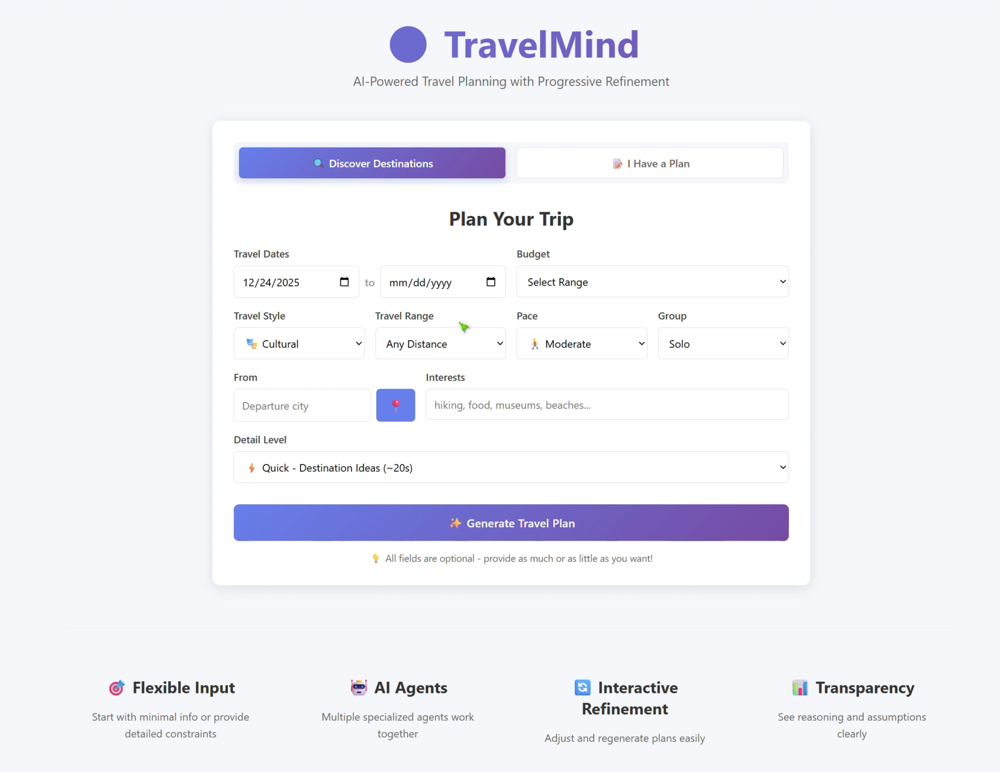
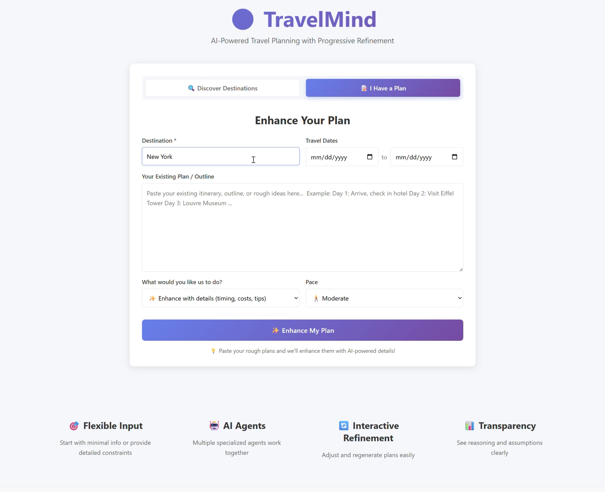
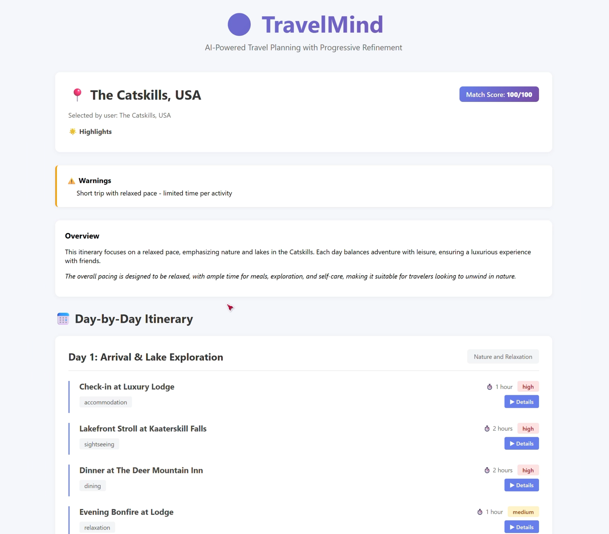
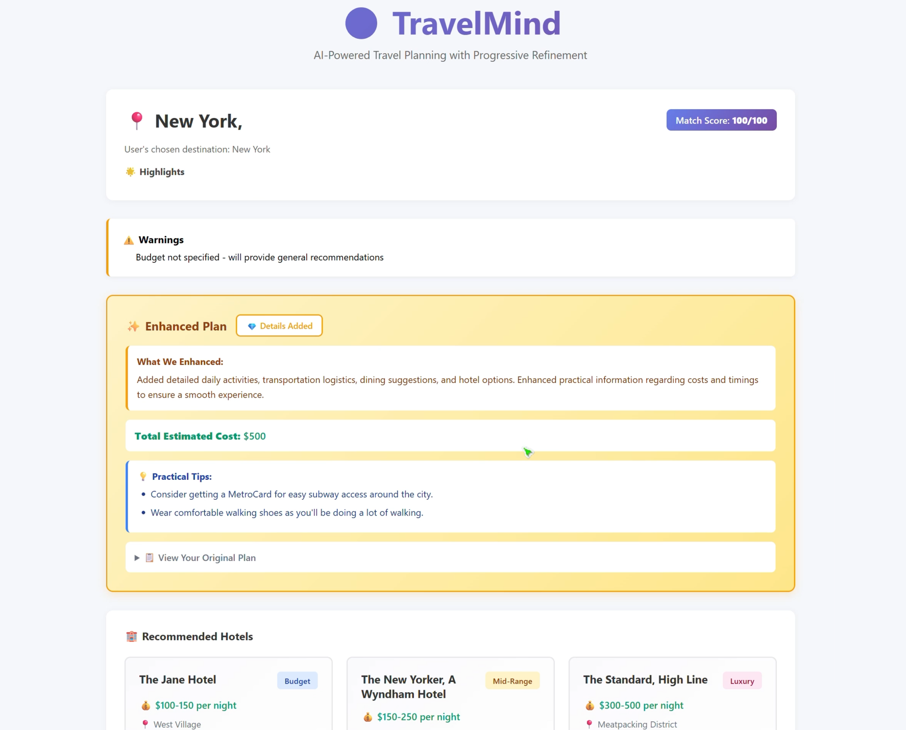

# TravelMind

TravelMind is a travel-planning system concept that explores how large language models can support itinerary generation, destination discovery, and plan refinement through a multi-agent workflow.

## Motivation

Travel planning is open-ended, preference-heavy, and often iterative. TravelMind was designed as a project to explore how an LLM-based system could turn sparse user input into structured travel recommendations while keeping room for refinement, transparency, and agent specialization.

## Repository Status

This public repository currently presents the **system design, architecture diagrams, product screenshots, and demo assets** for the project. It should be understood as a portfolio-ready project showcase rather than a full production code release.

## Why This Project Matters

- Demonstrates product thinking for an AI-native planning workflow
- Shows system design across user input, orchestration, enrichment, and refinement
- Presents a multi-agent decomposition instead of a single monolithic prompt
- Documents tradeoffs around reliability, transparency, and iterative interaction

## Key Features of the Proposed System

- Two planning modes: destination discovery and existing-plan enhancement
- Multi-agent orchestration for constraint parsing, recommendation, itinerary generation, and enrichment
- Progressive refinement workflow for follow-up edits and alternatives
- Support for varying detail levels, from high-level recommendations to richer itinerary drafts
- Dual-model enhancement concept for combining structured output with travel-domain suggestions

## Repository Contents

```text
.
|-- docs/
|   |-- architecture/
|   |   |-- architecture_diagram.html
|   |   |-- backend_structure.html
|   |   `-- data_flow_diagram.html
|   |-- demo/
|   |   `-- TravelMind_demo.mp4
|   |-- notes/
|   |   `-- dual_model_plan_enhancement.md
|   `-- screenshots/
|       |-- README.md
|       |-- discover_interface.png
|       |-- discover_result.png
|       |-- plan_interface.png
|       `-- plan_result.png
|-- .gitignore
`-- README.md
```

## Architecture / Workflow

At a high level, the system is designed around the following flow:

1. Collect user constraints such as destination, budget, pace, interests, and planning mode.
2. Normalize the request through a constraint parsing layer.
3. Route the request into destination recommendation or plan enhancement.
4. Generate or revise itinerary structure.
5. Enrich the output with additional details, assumptions, and practical suggestions.
6. Support iterative refinement based on follow-up user feedback.

The diagrams in `docs/architecture/` illustrate the intended backend flow, system components, and data movement in more detail.

## Setup

No installation is required to review the current public repository.

## How To Use This Repository

- Watch the demo video in `docs/demo/TravelMind_demo.mp4` for the fastest product overview.
- Review the screenshots in `docs/screenshots/` to understand the two core user flows.
- Open the HTML files in `docs/architecture/` in a browser to review the visual design artifacts.
- Read `docs/notes/dual_model_plan_enhancement.md` for the enhancement design note.
- Use this repository as a portfolio artifact that communicates system thinking, AI workflow design, and architecture clarity.

## Example Review Flow

If you are a recruiter, collaborator, or reviewer opening this project, the fastest way to evaluate it is:

1. Read this README for context.
2. Watch `docs/demo/TravelMind_demo.mp4`.
3. Scan the four product screenshots below.
4. Open `docs/architecture/architecture_diagram.html`.
5. Review `docs/notes/dual_model_plan_enhancement.md`.

## Demo / Screenshots

The strongest portfolio assets for this project are the end-to-end demo video and the four screenshots that show the main user journey from input to structured travel output.

Included assets:

- Discovery mode input:
  `docs/screenshots/discover_interface.png`
- Discovery mode result:
  `docs/screenshots/discover_result.png`
- Existing-plan enhancement input:
  `docs/screenshots/plan_interface.png`
- Existing-plan enhancement result:
  `docs/screenshots/plan_result.png`
- End-to-end demo video:
  `docs/demo/TravelMind_demo.mp4`

What the demo highlights:

- destination discovery from sparse travel preferences
- structured itinerary generation with warnings, pacing, and match scoring
- plan enhancement for users who already have a rough travel outline

Product tour:

| Discovery flow | Enhancement flow |
| --- | --- |
|  |  |
|  |  |

Watch the full walkthrough:

- [Watch the TravelMind demo video](docs/demo/TravelMind_demo.mp4)

## Results / Evaluation

This repository does not claim production metrics or benchmark results. Its current value is in:

- showing a polished AI product interface and end-to-end user flow
- clearly communicating the system concept
- documenting the multi-agent planning workflow
- showing AI product design maturity and implementation planning

## Future Improvements

- add the actual backend and frontend implementation, if available
- include a minimal runnable prototype for one end-to-end flow
- add sample prompts, example inputs, and example outputs
- document the agent prompts, orchestration logic, and evaluation criteria
- document design tradeoffs, limitations, and failure modes more explicitly

## Tech Stack

The documented system design references:

- Python / Flask for backend services
- React / Next.js for frontend delivery
- OpenAI models for structured itinerary generation
- Hugging Face models for domain-specific enhancement ideas

## Portfolio Review Summary

For resume and recruiter visibility, the strongest framing is:

- this is a thoughtful AI system design project
- it demonstrates architecture, workflow decomposition, and product reasoning
- it should not be presented as a finished public production system until the implementation code is included
